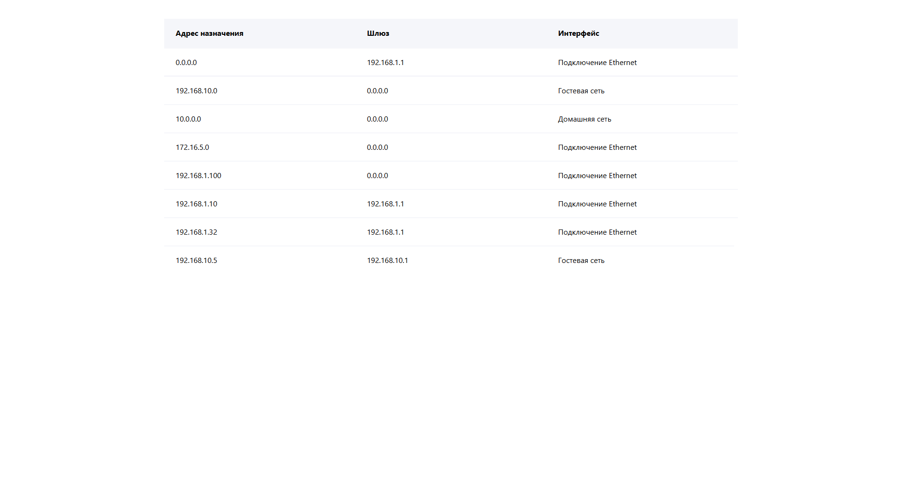

# 🧪 Тестовое задание в компанию НДМ Системы

Цель тестового задания — написать компонент и его логику с использованием **React, TypeScript, JavaScript, HTML и CSS**.  
Все детали задания описаны в папке `test_task`, предоставленной работодателем.

---

## 🚀 Используемый стек

  

---

## 🖼️ Превью компонента
| Компонент | Скриншот |
|-----------|----------|
| компонент |  

---
